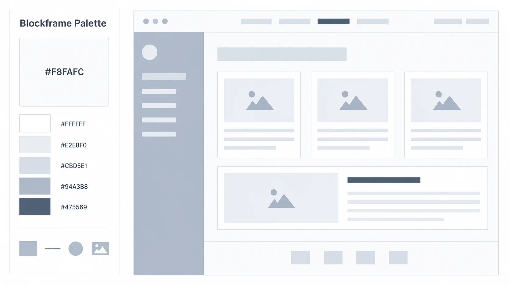

<div align="center">

# Kryon Blockframe Generator

**把前端截图、页面 Brief 或基础色，转换成结构清楚、可继续编辑的 Blockframe 规划稿。**

<p>
  
  
  
</p>

</div>

---

`kryon-blockframe-generator` 是一个面向 Codex 的独立 Skill，用来在视觉设计定稿之前明确页面区域、内容层级、对齐关系、间距节奏和颜色角色。它既能从截图提取可见结构，也能从页面 Brief 生成布局规划、色板、对比稿和响应式 HTML/CSS。

它关心的是“内容放在哪里、空间如何分配、什么最重要”，而不是提前制造一套看似完成、实际不可验证的品牌 UI。

## 案例：默认色板与 Dashboard 布局

下面是仓库内置的真实参考产物：左侧展示六个语义颜色，右侧用相同颜色系统构建 Dashboard Blockframe。图片尺寸为 `1672 × 941`，可直接作为色板＋布局组合板的构图参考。



这个案例明确展示了 Skill 的三个核心结果：颜色有语义、区域有层级、重复组件共享同一套尺寸与节奏。

## 能做什么

| 模式 | 输入 | 典型输出 |
| --- | --- | --- |
| 截图转换 | 前端模块、页面区块或完整页面截图 | 保留比例、顺序和对齐关系的 Blockframe PNG / SVG |
| 布局规划 | 页面类型、内容层级、目标视口 | 基于 Grid 和统一间距节奏的布局稿 |
| 色板生成 | 基础色或完整配色 | 带语义角色、色值和使用范围的色板 |
| 组合与对比 | 色板＋布局需求，或调整前后的规则 | 组合展示板、单变量前后对比图 |
| 代码复刻 | 截图、参考图或 Blockframe | 可运行、可编辑、响应式的 HTML/CSS |

默认颜色系统使用六个冷灰 Slate 色：`#F8FAFC`、`#FFFFFF`、`#E2E8F0`、`#CBD5E1`、`#94A3B8` 和 `#475569`。如果用户提供基础色或完整配色，用户输入始终优先，Skill 只补齐缺失的语义角色。

## 快速开始

Codex 会从用户级目录 `~/.agents/skills` 发现独立 Skill；也可以把它放进仓库的 `.agents/skills`，只对当前项目生效。安装后通常会自动检测，若未出现再重启 Codex。

```bash
mkdir -p ~/.agents/skills
git clone https://github.com/kryoncode/kryon-blockframe-generator.git \
  ~/.agents/skills/kryon-blockframe-generator
```

在 Codex CLI 或 IDE 扩展中输入 `$` 可以显式选择 Skill，也可以直接在提示词中写出名称：

```text
使用 $kryon-blockframe-generator，把这张商品卡片模块截图转换成 Blockframe。
保留原始尺寸、三列结构和元素数量，使用默认配色，输出 PNG 和可编辑 HTML/CSS。
```

也可以只给页面 Brief：

```text
使用 $kryon-blockframe-generator，为一个桌面端内容管理后台生成 Blockframe 布局规划图。
页面包含顶部导航、侧栏、四张摘要卡片、主表格和右侧辅助模块，目标视口为 1440 × 960。
```

## 工作方式

1. 先确定截图边界、页面类型、目标视口和交付格式，再从外到内拆分主要区域。
2. 在绘制之前确定语义色板、Grid 和间距节奏，让同一角色始终使用同一颜色与尺寸逻辑。
3. 用文本条、图片占位、头像、卡片和导航块抽象真实内容，同时保留元素数量、顺序、比例和共享对齐线。
4. 优先生成可验证的 HTML/CSS 或 SVG，最后检查尺寸、颜色、溢出、响应式行为以及截图估算值的标注。

## 设计边界

- 适合布局规划、截图结构抽象、色板、前后对比和可编辑 Blockframe 代码，不用于替代完整产品视觉设计。
- 截图只证明可见区域；Skill 不会凭空补齐隐藏交互、断点、状态或画面外内容。
- 默认输出移除真实产品文案和装饰性品牌图像，只保留理解结构所需的上下文。
- 当结果需要精确几何、中文文字和色值时，优先使用 HTML/CSS 或 SVG，而不是生成式位图。

## 仓库结构

```text
.
├── SKILL.md
├── agents/openai.yaml
├── assets/
│   ├── 01-Blockframe默认色板与布局参考.png
│   ├── 01-Blockframe默认色板与布局参考.webp
│   └── blockframe-tokens.css
└── references/
    ├── blockframe-spec.md
    └── screenshot-to-blockframe.md
```

详细的颜色、栅格、间距和验收标准见 [`references/blockframe-spec.md`](references/blockframe-spec.md)；截图转换的证据边界和映射规则见 [`references/screenshot-to-blockframe.md`](references/screenshot-to-blockframe.md)。

## 兼容性

该仓库遵循 Codex Skill 的目录结构：根目录包含带 `name` 和 `description` 元数据的 `SKILL.md`，并按需提供 `references/`、`assets/` 与 `agents/openai.yaml`。关于发现位置、调用方式和完整格式，请参考 [OpenAI 官方 Build skills 文档](https://learn.chatgpt.com/docs/build-skills)。

## License

当前仓库尚未声明开源许可证。仓库公开可见不等于自动授予复制、修改或再分发权限。

## Maintainer

由 [kryoncode](https://github.com/kryoncode) 维护。
